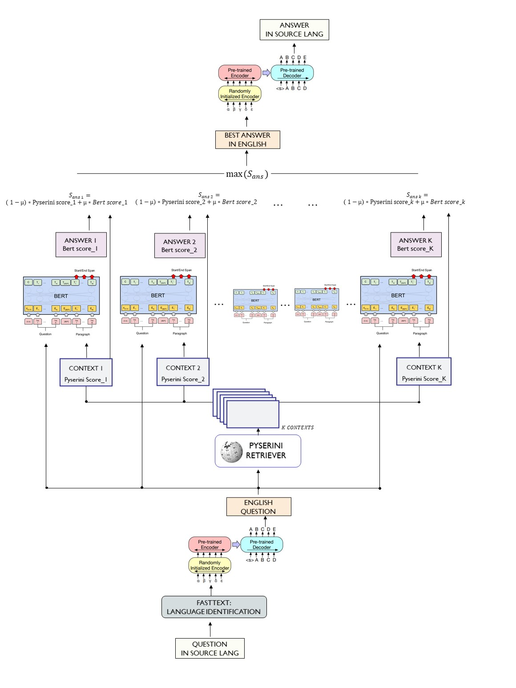

# Bertserini-on-Telegram



Bertserini-on-Telegram is a pytorch Bertserini implementation with a small utility to plug it in a Telegram bot.
The models and dataloaders are written in PyTorchLightning, and are usable on their own, or via PyTorchLightning CLI.

## Project Structure

### A typical top-level directory layout

    .
    ├── bertserini_on_telegram      # Actual project code
    |    ├── data                   # contains the DataModules to handle SQuAD V1.1
    |    ├── models                 # holds the Modules to run validation and inference with BERT
    |    └── utils                  # general helper functions
    ├── examples                    # Example scripts of how to run the code
    ├── LICENSE
    └── README.md


## Installation

Install via [pip](https://pypi.org/project/bertserini-on-telegram/)

```bash
pip install bertserini-on-telegram
```

## Usage

The fastest way to learn how to use this package is by heading on tothe examples folder, and have a look at the python scripts saved in there. In each example folder, there is a config.yaml file holding the run parameters, a script.py file where the actual example code is, and a runnable script.sh file that shows how to run a PytorchLightningCli script with a config file.

To run an example, simply
```bash
cd examples/<example_dir>
./example_shell_script.sh
```


## Running it on Telegram

The telegram example supposes that the used knows how to create a Telegram bot in the first place. Telegram has an awesome tutorial on how to do it, you can find it [here](https://core.telegram.org/bots#3-how-do-i-create-a-bot). 

Once the bot is online, the next step is to insert the bot's private token into the config.yaml file, as shown below (the file needs to be created)

#### **`./example/telegram_bot/telegram_token_id.yaml`**
```yaml
token_id: <token_id>
```


> Be careful when adding a bot to a group, it must have the necessary permission to be able to read the messages.

Now just run the example as shown in the snippet below, and you are good to go :)
```bash
cd examples/telegram_bot
./run_bertbot.sh
```

